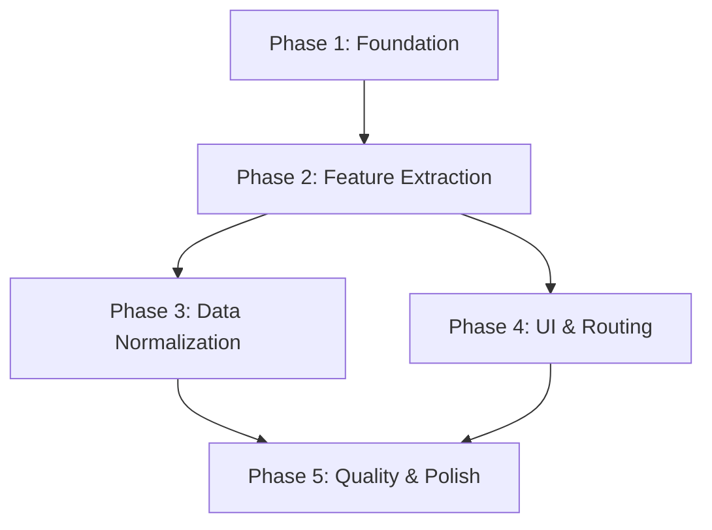

# PMP Learning Platform — Refactoring Plan

> **Mục tiêu:** Chuyển từ kiến trúc monolithic (nhiều file lớn, global namespace, code lặp) sang kiến trúc module hóa, dễ bảo trì, mở rộng và test.

---

## Hiện trạng & Vấn đề chính

| # | Vấn đề | Ảnh hưởng |
|---|--------|-----------|
| 1 | `app.js` (500 LOC) chứa UI + state + iframe + highlights + quiz | Khó debug, sửa 1 tính năng ảnh hưởng tính năng khác |
| 2 | `lms.js` (400 LOC) mix storage + spaced repetition + MongoDB + analytics + UI | Không test được từng phần |
| 3 | Code highlight bị duplicate giữa PMBOK6 reader, Rita, Exam | Sửa bug phải sửa 3 chỗ |
| 4 | Global namespace pollution (`window.PMLibConfig`, etc.) | Race condition, thứ tự load file quan trọng |
| 5 | Data format không nhất quán giữa các module | Dashboard aggregation fragile |
| 6 | Iframe bridge script nhúng dưới dạng string literal | Không syntax highlight, không debug được |
| 7 | `vocab-terms.js` 2000+ dòng load hết lên memory | Chậm trên mobile |
| 8 | Không có error handling / offline fallback nhất quán | Silent failures |
| 9 | Magic strings (chapter IDs, storage keys) rải khắp nơi | Typo = bug ẩn |
| 10 | Không có build step → không minify, không tree-shake | Không ảnh hưởng lớn nhưng khó scale |

---

## Kiến trúc mới đề xuất

```
pmp/
├── index.html                  # Entry point (SPA shell)
├── vite.config.js              # Build tool (lightweight, zero-config)
├── package.json
│
├── src/
│   ├── main.js                 # App bootstrap, router
│   ├── router.js               # Simple hash-based router
│   │
│   ├── core/                   # Shared infrastructure
│   │   ├── storage.js          # Unified storage layer (IndexedDB + localStorage fallback)
│   │   ├── atlas-client.js     # MongoDB Atlas Data API client
│   │   ├── event-bus.js        # Pub/sub cho cross-module communication
│   │   ├── constants.js        # All magic strings, IDs, keys
│   │   └── utils.js            # Shared utilities
│   │
│   ├── features/
│   │   ├── reader/             # PMBOK6 + Rita chapter reader
│   │   │   ├── reader.js       # Core reader logic
│   │   │   ├── highlights.js   # Highlight engine (unified)
│   │   │   ├── iframe-bridge.js # Iframe communication (tách ra file riêng)
│   │   │   └── reader.css
│   │   │
│   │   ├── quiz/               # Quiz engine (shared)
│   │   │   ├── quiz-engine.js  # Core quiz logic
│   │   │   ├── quiz-ui.js      # Quiz rendering
│   │   │   └── quiz.css
│   │   │
│   │   ├── exam/               # PMP Exam simulator
│   │   │   ├── exam.js         # Exam orchestrator
│   │   │   ├── scoring.js      # Scoring & analytics
│   │   │   ├── practice.js     # Practice mode
│   │   │   └── exam.css
│   │   │
│   │   ├── vocab/              # Vocabulary flashcards
│   │   │   ├── vocab.js        # Flashcard logic
│   │   │   ├── vocab-data.js   # Term data (lazy-loaded JSON)
│   │   │   └── vocab.css
│   │   │
│   │   ├── lms/                # Learning Management
│   │   │   ├── progress.js     # Progress tracking
│   │   │   ├── spaced-rep.js   # Spaced repetition algorithm
│   │   │   ├── sync.js         # Online/offline sync
│   │   │   └── lms.css
│   │   │
│   │   └── dashboard/          # Analytics dashboard
│   │       ├── dashboard.js
│   │       ├── charts.js
│   │       └── dashboard.css
│   │
│   ├── ui/                     # Shared UI components
│   │   ├── font-settings.js
│   │   ├── theme.js
│   │   ├── toast.js
│   │   └── components.css
│   │
│   └── data/                   # Static data (moved from inline)
│       ├── books-config.json
│       ├── vocab-terms.json    # Converted from .js → .json (lazy load)
│       └── chapter-map.json
│
├── public/                     # Static assets (không qua build)
│   └── books/                  # HTML content chapters (giữ nguyên)
│
└── tests/                      # Unit tests
    ├── storage.test.js
    ├── quiz-engine.test.js
    ├── spaced-rep.test.js
    └── scoring.test.js
```

---

## Phases triển khai

### Phase 1: Foundation (Tuần 1)
> Thiết lập build tool + tách core modules, KHÔNG thay đổi behavior

| # | Task | Files | Effort |
|---|------|-------|--------|
| 1.1 | Init Vite + cấu hình cho vanilla JS | `vite.config.js`, `package.json` | S |
| 1.2 | Tạo `src/core/constants.js` — extract tất cả magic strings | Mới | S |
| 1.3 | Tạo `src/core/storage.js` — unified storage API | Merge logic từ `lms.js` + `pmp-exam/js/storage.js` | M |
| 1.4 | Tạo `src/core/event-bus.js` | Mới | S |
| 1.5 | Tạo `src/core/atlas-client.js` — extract từ `lms.js` | Tách từ `lms.js` | S |
| 1.6 | Migrate `index.html` → Vite entry point | Sửa `index.html` | S |

**Deliverable:** Project chạy được với Vite, core modules có ES module exports.

---

### Phase 2: Feature Extraction (Tuần 2)
> Tách từng feature thành module độc lập

| # | Task | Source → Target | Effort |
|---|------|-----------------|--------|
| 2.1 | Extract reader module | `app.js` → `src/features/reader/` | L |
| 2.2 | Extract & unify highlight engine | `app.js` bridge script → `src/features/reader/highlights.js` | L |
| 2.3 | Extract iframe bridge thành file riêng | String literal trong `app.js` → `src/features/reader/iframe-bridge.js` | M |
| 2.4 | Extract quiz engine | `app.js` quiz logic + `rita-quiz.html` inline → `src/features/quiz/` | M |
| 2.5 | Extract LMS/progress | `lms.js` → `src/features/lms/` (3 files) | M |
| 2.6 | Extract exam simulator | `pmp-exam/js/*` → `src/features/exam/` | M |
| 2.7 | Extract vocab module | `vocab.html` inline + `lib/vocab-terms.js` → `src/features/vocab/` | M |
| 2.8 | Extract dashboard | `dashboard.html` inline → `src/features/dashboard/` | S |

**Deliverable:** Mỗi feature là module độc lập, import từ `core/`.

---

### Phase 3: Data Normalization (Tuần 3)
> Thống nhất data format, migration strategy

| # | Task | Chi tiết | Effort |
|---|------|----------|--------|
| 3.1 | Define unified data schemas | TypeScript-style JSDoc cho Progress, Highlight, QuizResult | S |
| 3.2 | Migrate highlight format | Thống nhất PMBOK6 + Rita highlights về 1 format | M |
| 3.3 | Convert `books-config.js` → JSON + loader | Bỏ global, lazy load | S |
| 3.4 | Convert `vocab-terms.js` → JSON + pagination | Chunk 50 terms/page, search index | M |
| 3.5 | Storage migration script | Migrate localStorage keys cũ → format mới | M |
| 3.6 | Offline-first sync strategy | Queue changes → batch sync khi online | M |

**Deliverable:** Một data layer nhất quán, có migration path.

---

### Phase 4: UI & Routing (Tuần 4)
> SPA navigation, shared UI components

| # | Task | Chi tiết | Effort |
|---|------|----------|--------|
| 4.1 | Implement hash router | `src/router.js` — map routes → feature modules | S |
| 4.2 | Convert multi-page → SPA | Merge `home.html`, `dashboard.html`, `vocab.html`, `rita-quiz.html` | L |
| 4.3 | Shared font-settings component | Extract + apply consistently | S |
| 4.4 | Toast/notification system | Replace `alert()` calls | S |
| 4.5 | Responsive CSS refactor | Merge `style.css` + `lms.css` → modular CSS | M |
| 4.6 | Dark mode support | Theme variables | S |

**Deliverable:** SPA chạy mượt, consistent UI.

---

### Phase 5: Quality & Polish (Tuần 5)
> Testing, error handling, performance

| # | Task | Chi tiết | Effort |
|---|------|----------|--------|
| 5.1 | Add Vitest cho unit tests | Test core modules | M |
| 5.2 | Error boundary + toast errors | Graceful degradation | S |
| 5.3 | Lazy loading cho exam questions | Load theo chunk | S |
| 5.4 | Service Worker cho offline | Cache HTML chapters | M |
| 5.5 | Performance audit | Lighthouse, bundle size | S |
| 5.6 | Cleanup legacy files | Remove old HTML pages, unused code | S |

**Deliverable:** Production-ready, tested, performant.

---

## Nguyên tắc Refactor

1. **Không break behavior** — mỗi phase kết thúc, app phải chạy đúng như trước
2. **Incremental** — có thể dừng ở bất kỳ phase nào mà vẫn có giá trị
3. **Data backward-compatible** — localStorage/IndexedDB cũ phải được migrate, không mất data
4. **No over-engineering** — vanilla JS + Vite, không React/Vue/Angular
5. **Feature flags** — dùng `const USE_NEW_STORAGE = true` để toggle giữa old/new code trong quá trình chuyển đổi

---

## Dependency Graph (thứ tự build)



---

## Risk & Mitigation

| Risk | Mitigation |
|------|-----------|
| Mất highlight data khi migrate | Migration script test trên copy of localStorage trước |
| Iframe bridge break sau refactor | E2E test manual từng chapter |
| Vite conflict với existing HTML files | Dùng `public/` cho static content, `src/` cho code |
| Exam questions format incompatible | Adapter pattern: old format → new format |

---

## Quick Wins (có thể làm ngay, không cần đợi full refactor)

1. **Extract iframe bridge** từ string literal → file riêng (`iframe-bridge.js`) — dễ debug hơn ngay lập tức
2. **`constants.js`** — tập trung magic strings, giảm typo bugs
3. **Convert `vocab-terms.js` → JSON** — giảm 50% parse time
4. **Add `.gitignore`** nếu chưa có (node_modules, .env)
5. **Error toast** thay thế silent failures

---

## Ước lượng tổng

- **Total effort:** ~4-5 tuần (part-time) hoặc ~2 tuần (full-time)
- **Rủi ro cao nhất:** Phase 2.1-2.3 (reader + highlights) vì logic phức tạp nhất
- **ROI cao nhất:** Phase 1 + Quick Wins — ngay lập tức dễ maintain hơn
